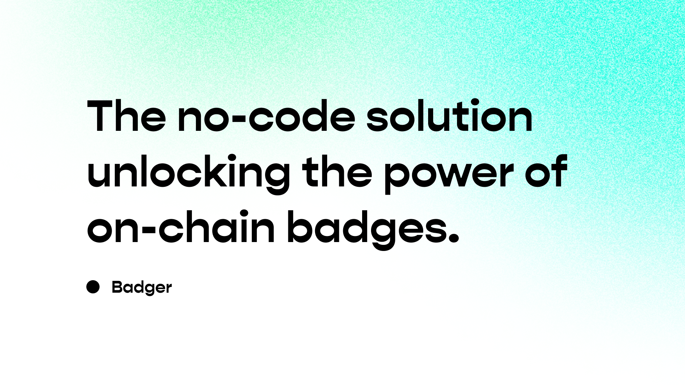

# Badger

Badger is a primitive driving seamless on-chain creation of Organizations and Badges that can be used to turbocharge the granular power of on-chain access for every member. With a unique model in place, an Organization can mint Badges that act as keys to access all of the existing Web3 gates and locks using a forward-looking and secure access policy implementation.

Built on the standard [ERC-1155](https://eips.ethereum.org/EIPS/eip-1155), Badges allow for middle-out management of any on-chain organization. With this capability, every consumer of Badger has the ability to choose if their organization will be top-down, middle-out or bottom-up in nature.

## Running The Dapp

Getting up and running with Badger is simple, although there are many pieces to get running. We've included a docker-compose file that will get you up and running with the Badger dapp and all of its dependencies such as:

* Local Hardhat Node
* Database running on Postgres
* Redis enabling the use of Websockets
* Backend running on Django
* Frontend running on React 

Packed into a single command, you can get up and running with Badger in no time.

### Prerequisites

Running Badger is simple due to the use of Docker, but there are a few things you'll need to get started; primarily the things needed to run a Docker container.

- Node.js 
- Docker

#### Paid services

- [FontAwesomePro Account](https://fontawesome.com/account#pro-package-tokens) (for icons)
- [Pinata Account](https://docs.pinata.cloud/pinata-api/authentication) (for IPFS)

### Running the Dapp

- [Fork the repository](https://github.com/flipsidecrypto/badger/fork).
- Setup `.env` to reflect `example.env`.
  - To run Badger locally you only need to set:
    - `NPM_TOKEN`
    - `API_PINATA_API_KEY`
    - `API_PINATA_API_SECRET_KEY`
- Run `docker compose up --build --remove-orphans` in an active terminal within the root directory.

### Helpers

Although everything has been bundled into a single command, there are a few helpers to make your life easier. Hopefully, you never need to run these but if you are making changes or working on a pull request, you likely will need one of them.

#### Database Migrations

The Badger backend is built using Django. Anytime there are changes to the database schema the migrations need to be made and applied. 

> If you're just forking, we've already pre-built the migrations, you just need to apply them to your database. Migrations are automatically applied when you build using Docker, but if you have an issue this is how you can migrate the database manually. 

- terminal: `docker compose run --rm badger_server python manage.py migrate`

#### Testing The Contract

Testing contracts is a critical step before deployment. We've included a few helpers to make this process easier. 

- terminal: `docker compose run --rm badger_node node npx hardhat coverage --network localhost`

## Contract Tests

```
Version
=======
> solidity-coverage: v0.8.2

Instrumenting for coverage...
=============================

> Badger\Badger.sol
> Badger\BadgerVersions.sol
> Badger\interfaces\BadgerInterface.sol
> Badger\interfaces\BadgerVersionsInterface.sol
> BadgerOrganization\BadgerOrganization.sol
> BadgerOrganization\BadgerScout.sol
> BadgerOrganization\interfaces\BadgerOrganizationInterface.sol
> BadgerOrganization\interfaces\BadgerScoutInterface.sol
> Mocks\MockERC1155.sol
> Mocks\MockERC20.sol
> Mocks\MockERC721.sol

Compilation:
============

Compiled 50 Solidity files successfully
> server:            http://127.0.0.1:8545

Network Info
============
> port:         localhost
> network:      v2.13.2

Compiled 50 Solidity files successfully


  Badger
    Badger: Badger.sol
      ✔ Should deploy the Badger contract (136ms)
      ✔ createOrganization() success (732ms)
      ✔ createOrganization() success: payable (1653ms)
      ✔ createOrganization() fail: insufficient funding (166ms)
      ✔ onERC1155Received() fail: invalid payment token (993ms)
    Badger: BadgerVersions.sol
      ✔ setVersion() success (353ms)
      ✔ setVersion() success: exogenous (422ms)
      ✔ setVersion() fail: not owner (222ms)
      ✔ setVersion() fail: locked (557ms)
      ✔ setVersion() fail: not allowed to set payment token (462ms)
      ✔ getVersionKey() success (76ms)
      ✔ getLicenseKey() success (130ms)
      ✔ execTransaction() success (488ms)
      ✔ execTransaction() fail: is not built (177ms)
      ✔ execTranscation() fail: is not owner (171ms)
      ✔ supportsInterface() success (349ms)
    Badger: BadgerScout.sol
      ✔ initialize() fail: cannot call twice (132ms)
      ✔ setOrganizationURI() success (265ms)
      ✔ setOrganizationURI() fail: not owner (117ms)
      ✔ setBadge() success (489ms)
      ✔ setBadge() fail: not leader (130ms)
      ✔ setBadge() fail: uri cannot be empty (123ms)
      ✔ setBadge() success (496ms)
      ✔ setClaimable() success (367ms)
      ✔ setClaimable() fail: not real badge (133ms)
      ✔ setClaimable() fail: not leader (93ms)
      ✔ setAccountBound() success (803ms)
      ✔ setAccountBound() fail: not real badge (129ms)
      ✔ setAccountBound() fail: not leader (109ms)
      ✔ setSigner() success (789ms)
      ✔ setSigner() fail: not real badge (98ms)
      ✔ setSigner() fail: not leader (142ms)
      ✔ setBadgeURI() success (165ms)
      ✔ setBadgeURI() fail: not real badge (129ms)
      ✔ setBadgeURI() fail: not leader (139ms)
      ✔ setBadgeURI() fail: uri cannot be empty (92ms)
      ✔ setPaymentToken() success (231ms)
      ✔ setPaymentToken() fail: not real badge (56ms)
      ✔ setPaymentToken() fail: not leader (131ms)
      ✔ setDelegates() success (806ms)
      ✔ setDelegates() fail: not real badge (114ms)
      ✔ setDelegates() fail: not leader (124ms)
      ✔ setDelegates() fail: arrays not equal length (111ms)
      ✔ setDelegatesBatch() success (334ms)
      ✔ setDelegatesBatch() fail: not real badge (115ms)
      ✔ setDelegatesBatch() fail: not leader (138ms)
      ✔ setDelegatesBatch() fail: arrays not equal length (137ms)
      ✔ execTransaction() success (497ms)
      ✔ execTransaction() fail: is not built (141ms)
      ✔ execTranscation() fail: is not owner (128ms)
    Badger: BadgerOrganization.sol
      ✔ leaderMint() success (198ms)
      ✔ leaderMint() fail: not real badge (113ms)
      ✔ leaderMint() fail: not leader (93ms)
      ✔ leaderMintBatch() success (246ms)
      ✔ leaderMintBatch() fail: not real badge (146ms)
      ✔ leaderMintBatch() fail: not leader (153ms)
      ✔ leaderMintBatch() fail: arrays not equal length (173ms)
      ✔ leaderMintFullBatch() success (210ms)
      ✔ leaderMintFullBatch() success: delegate (409ms)
      ✔ leaderMintFullBatch() fail: not real badge (127ms)
      ✔ leaderMintFullBatch() fail: not leader (106ms)
      ✔ leaderMintFullBatch() fail: arrays not equal length (123ms)
      ✔ revoke() success (184ms)
      ✔ revoke() fail: insufficient balance (113ms)
      ✔ revoke() fail: not leader (123ms)
      ✔ revokeBatch() (471ms)
      ✔ revokeBatch() fail: not leader (123ms)
      ✔ revokeBatch() fail: arrays not equal length (107ms)
      ✔ revokeFullBatch() success (216ms)
      ✔ revokeFullBatch() success: delegate (500ms)
      ✔ revokeFullBatch() fail: insufficient balance (110ms)
      ✔ revokeFullBatch() fail: not leader (108ms)
      ✔ revokeFullBatch() fail: arrays not equal length (109ms)
      ✔ forfeit() success (202ms)
      ✔ forfeit() fail: insufficient balance (124ms)
      ✔ safeTransferFrom() success (667ms)
      ✔ safeTransferFrom() success: leader can transfer account bound (782ms)
      ✔ safeTransferFrom() success: delegate can transfer account bound (1165ms)
      ✔ safeTransferFrom() success: can transfer to contract (434ms)
      ✔ safeTransferFrom() fail: transferring out of contract as user (114ms)
      ✔ safeTransferFrom() fail: account bound (529ms)
      ✔ safeBatchTransferFrom() success (748ms)
      ✔ safeBatchTransferFrom() success: leader can transfer account bound (952ms)
      ✔ safeBatchTransferFrom() success: delegate can transfer account bound (1106ms)
      ✔ safeBatchTransferFrom() success: can transfer to contract (431ms)
      ✔ safeBatchTransferFrom() fail: transferring out of contract as user (115ms)
      ✔ safeBatchTransferFrom() fail: account bound (542ms)
      ✔ depositETH() success (667ms)
      ✔ depositETH() fail: not real badge (158ms)
      ✔ depositETH() fail: not claimable (533ms)
      ✔ depositETH() fail: invalid payment token (650ms)
      ✔ depositERC20() success (1397ms)
      ✔ depositERC20() fail: not real badge (128ms)
      ✔ depositERC20() fail: not claimable (455ms)
      ✔ depositERC20() fail: invalid payment token (571ms)
      ✔ depositERC20() fail: not enough allowance (1067ms)
      ✔ onERC1155Received() success (1135ms)
      ✔ onERC1155Received() success: normal transfer (520ms)
      ✔ onERC1155Received() fail: not real badge (200ms)
      ✔ onERC1155Received() fail: not claimable (368ms)
      ✔ onERC1155Received() fail: invalid payment token (673ms)
      ✔ onERC1155Received() fail: not enough balance (668ms)
      ✔ onERC721Received() success (3615ms)
      ✔ onERC721Received() success: normal transfer (355ms)
      ✔ onERC721Received() fail: not real badge (254ms)
      ✔ onERC721Received() fail: not claimable (1001ms)
      ✔ onERC721Received() fail: invalid payment token (768ms)
      ✔ claimMint() success: signature (1817ms)
      ✔ claimMint() success: claimable (1773ms)
      ✔ claimMint() fail: invalid signature (1404ms)
      ✔ claimMint() fail: not real badge (833ms)
      ✔ claimMint() fail: not claimable (372ms)
      ✔ claimMint() fail: amount is zero (108ms)
      ✔ claimMint() fail: has not funded (391ms)
      ✔ uri() success: has badge uri (86ms)
      ✔ uri() success: no badge uri (138ms)
      ✔ contractURI() success (155ms)
      ✔ supportsInterface() success (654ms)


  118 passing (54s)

----------------------------------|----------|----------|----------|----------|----------------|
File                              |  % Stmts | % Branch |  % Funcs |  % Lines |Uncovered Lines |
----------------------------------|----------|----------|----------|----------|----------------|
 BadgerOrganization\              |      100 |      100 |      100 |      100 |                |
  BadgerOrganization.sol          |      100 |      100 |      100 |      100 |                |
  BadgerScout.sol                 |      100 |      100 |      100 |      100 |                |
 BadgerOrganization\interfaces\   |      100 |      100 |      100 |      100 |                |
  BadgerOrganizationInterface.sol |      100 |      100 |      100 |      100 |                |
  BadgerScoutInterface.sol        |      100 |      100 |      100 |      100 |                |
 Badger\                          |      100 |      100 |      100 |      100 |                |
  Badger.sol                      |      100 |      100 |      100 |      100 |                |
  BadgerVersions.sol              |      100 |      100 |      100 |      100 |                |
 Badger\interfaces\               |      100 |      100 |      100 |      100 |                |
  BadgerInterface.sol             |      100 |      100 |      100 |      100 |                |
  BadgerVersionsInterface.sol     |      100 |      100 |      100 |      100 |                |
 Mocks\                           |      100 |      100 |      100 |      100 |                |
  MockERC1155.sol                 |      100 |      100 |      100 |      100 |                |
  MockERC20.sol                   |      100 |      100 |      100 |      100 |                |
  MockERC721.sol                  |      100 |      100 |      100 |      100 |                |
----------------------------------|----------|----------|----------|----------|----------------|
All files                         |      100 |      100 |      100 |      100 |                |
----------------------------------|----------|----------|----------|----------|----------------|
```
